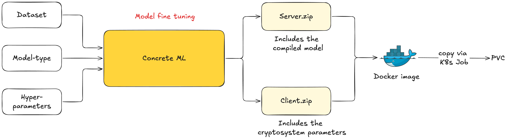
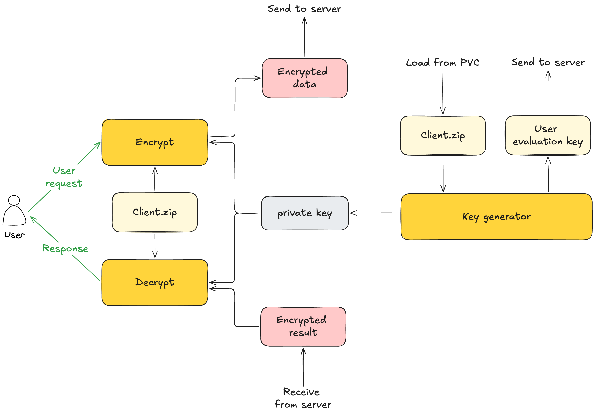

# FHE-User-Behavior: Privacy-Preserving User Purchase Prediction with Fully Homomorphic Encryption

[](https://www.python.org/)
[](https://docs.zama.ai/concrete-ml)
[](https://fastapi.tiangolo.com/)
[](https://gradio.app/)
[](https://cloud.google.com/kubernetes-engine)
[](https://argo-cd.readthedocs.io/)
[](https://www.jenkins.io/)
[](https://link.springer.com/chapter/10.1007/978-981-95-4957-3_33)

> This project is the official MLOps implementation of the research paper published at **MIWAI 2025** (Springer LNCS, SCOPUS-indexed):
>
> **Balancing Accuracy and Latency in Privacy-Preserving User Behavior Classification with Tree-Based Models**
> — Kiet Nguyen Tuan, Vo Minh Tri, Nguyen Duc Thai
> [→ Read on Springer](https://link.springer.com/chapter/10.1007/978-981-95-4957-3_33)

---

## Overview

This project implements a **privacy-preserving machine learning system** for predicting user purchase behavior. Using **Fully Homomorphic Encryption (FHE)**, the server runs inference directly on encrypted customer data — without ever seeing the plaintext inputs or outputs.

The system is built on [Concrete ML](https://docs.zama.ai/concrete-ml) by Zama and deployed end-to-end on **Google Kubernetes Engine (GKE)** with a full MLOps pipeline.

---

## Key Features

- **FHE inference** — XGBoost model runs on encrypted data via Concrete ML
- **Privacy by design** — server never accesses plaintext customer attributes
- **Interactive demo** — step-by-step Gradio UI showing keygen → encrypt → inference → decrypt
- **Production-ready MLOps** — CI/CD with Jenkins + ArgoCD GitOps, monitoring with Prometheus + Grafana + Loki, distributed tracing with Jaeger

---

## Tech Stack

### Machine Learning
| Component | Technology |
|---|---|
| FHE framework | [Concrete ML 1.4.0](https://docs.zama.ai/concrete-ml) |
| Model | XGBoost via `ConcreteXGBoostClassifier` (selected from paper results as best accuracy-latency trade-off) |
| Quantization | 7-bit |

### Application
| Component | Technology |
|---|---|
| Backend API | FastAPI |
| Frontend demo | Gradio |
| Tracing | OpenTelemetry → Jaeger |

### MLOps / Infrastructure
| Component | Technology |
|---|---|
| Cloud | Google Cloud Platform (GKE, GCE, GAR) |
| IaC | Terraform (cluster), Ansible (Jenkins VM), Helm (components) |
| CI | Jenkins (Pytest → Docker build → push to GAR) |
| CD | ArgoCD (GitOps, webhook-triggered) |
| Monitoring | Prometheus + Grafana + Loki + Alertmanager |
| Ingress | NGINX Ingress Controller |
| Persistent storage | Kubernetes PVC |

---

## Architecture

### 1. System Architecture Overview

End-to-end MLOps pipeline from developer push to GKE deployment, with full observability stack.


The flow:
- **IaC**: Terraform provisions GKE, Ansible configures Jenkins on GCE, Helm deploys system components (ArgoCD, monitoring, NGINX)
- **CI/CD**: Developer pushes code → GitHub webhook triggers Jenkins → Pytest → Docker build → push to GAR → update manifest → ArgoCD webhook → apply to cluster
- **Observability**: Prometheus scrapes metrics, Loki collects logs via Promtail, Jaeger receives traces from FastAPI via OpenTelemetry, all visualized in Grafana via NGINX

---

### 2. Model Training & Packaging

How the FHE model is trained, compiled, and packaged for deployment.



- Dataset + Model type + Hyperparameters → **Concrete ML** compiles FHE circuit
- Output: `server.zip` (compiled FHE model) + `client.zip` (cryptosystem parameters)
- Both files are baked into the Docker image and copied to a **PVC** via a Kubernetes Job (`upload-model-job`) at deploy time

---

### 3. FHE Client-Side Workflow

How the Gradio client encrypts user data, sends to FastAPI, and decrypts the result.



Step-by-step:
1. **Key generation** — `client.zip` (loaded from PVC) → Concrete ML generates private key + evaluation key
2. **Send eval key** → FastAPI server (used for FHE computation, cannot decrypt data)
3. **Encrypt** — user request data + private key + `client.zip` → encrypted ciphertext
4. **Send encrypted data** → FastAPI server
5. **FHE inference** — server runs XGBoost on ciphertext using eval key (never sees plaintext)
6. **Receive encrypted result** ← FastAPI server
7. **Decrypt** — encrypted result + private key → plaintext prediction → Response to user

---

## Getting Started

### Prerequisites

```bash
python >= 3.10
concrete-ml >= 1.4.0
docker
kubectl
helm
```

### Train and compile the FHE model

```bash
pip install -r requirements.txt
python development.py
# Outputs: deployment/model/server.zip, client.zip, processing.json
#          deployment/preprocessor.pkl
```

### Run locally

```bash
# Start FastAPI server
uvicorn backend.app.main:app --host 0.0.0.0 --port 8000

# Start Gradio demo (separate terminal)
python app.py
# Open http://localhost:7860
```

## Research Paper

This implementation is based on the following peer-reviewed publication:

> **Balancing Accuracy and Latency in Privacy-Preserving User Behavior Classification with Tree-Based Models**
>
> Kiet Nguyen Tuan, Vo Minh Tri, Nguyen Duc Thai
>
> In: *Multi-disciplinary Trends in Artificial Intelligence (MIWAI 2025)*
> Lecture Notes in Computer Science (LNAI), vol 16353, pp. 406–417
> Springer, Singapore, 2026
>
> DOI: [10.1007/978-981-95-4957-3_33](https://link.springer.com/chapter/10.1007/978-981-95-4957-3_33)

**Abstract:** FHE enables ML models to operate directly on encrypted data. This study evaluates three tree-based classifiers on encrypted user behavior data under different computation depths and quantization bit-widths. XGBoost consistently achieves the best balance between predictive accuracy and FHE inference latency — and is therefore the model deployed in this demo.

If you use this work, please cite:

```bibtex
@InProceedings{nguyen2026fhe,
  author    = {Nguyen Tuan, Kiet and Tri, Vo Minh and Thai, Nguyen Duc},
  title     = {Balancing Accuracy and Latency in Privacy-Preserving User Behavior Classification with Tree-Based Models},
  booktitle = {Multi-disciplinary Trends in Artificial Intelligence},
  year      = {2026},
  publisher = {Springer, Singapore},
  pages     = {406--417},
  doi       = {10.1007/978-981-95-4957-3_33},
  series    = {Lecture Notes in Computer Science},
  volume    = {16353}
}
```

---

## References

- [Concrete ML Documentation](https://docs.zama.ai/concrete-ml) — Zama's Privacy-Preserving ML library
- [Zama FHE encrypted credit scoring demo](https://huggingface.co/spaces/zama-fhe/encrypted_credit_scoring) — inspiration for the FHE demo UI pattern